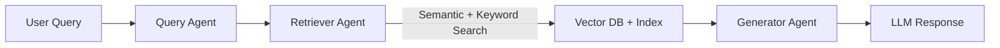

# 🔎 RAG Pipeline with Agentic Workflow  

A **modular Retrieval-Augmented Generation (RAG) pipeline** built with **agentic workflows**, enabling query decomposition, hybrid retrieval, and context-aware response generation. This project demonstrates how small agents can orchestrate retrieval and generation to deliver accurate answers with reduced hallucinations.  

## ✨ Features  
- **Agentic Workflow** → Query Analyzer, Retriever Agent, and Generator Agent working collaboratively.  
- **Hybrid Retrieval** → Combines semantic search (vector embeddings) + keyword search for high-precision results.  
- **Vector Database Integration** → FAISS for fast and scalable similarity search.  
- **LLM Integration** → Seamless orchestration with LLMs for context-aware QA.  
- **Modular & Extensible** → Plug-and-play design to add new retrievers, embeddings, or data sources.  

## 🛠️ Tech Stack  
- Python  
- FAISS (Vector Search)  
- HuggingFace Transformers (Embeddings + LLMs)  
- LangChain (optional, for orchestration)  
- Jupyter Notebook  

## ⚙️ Workflow  
1. **Data Ingestion & Preprocessing** → Documents are chunked and embedded.  
2. **Agentic Query Handling** → Query is analyzed and routed by agents.  
3. **Hybrid Retrieval** → Semantic + keyword-based retrieval ensures accuracy.  
4. **LLM Response Generation** → Retrieved context is passed to LLM for precise answers.  



## 🚀 Getting Started  

### 1. Clone the Repository  
```bash
git clone https://github.com/banno-0720/agentic-rag-pipeline.git
cd agentic-rag-pipeline
```

### 2. Install Dependencies  
```bash
pip install -r requirements.txt
```

### 3. Run the Notebook  
```bash
jupyter notebook RAG_model.ipynb
```

## 📊 Example Output  
- Input: *"What are the benefits of Retrieval-Augmented Generation?"*  
- Output: *"Retrieval-Augmented Generation improves factual correctness by grounding answers in external knowledge, reducing hallucinations, and enabling domain-specific QA."*  

## 📌 Future Enhancements  
- API endpoints for deployment (FastAPI/Flask).  
- Support for multiple vector databases (Pinecone, Weaviate).  
- Integration with streaming LLMs for real-time QA.  

## 🤝 Contributing  
Feel free to fork this repo, open issues, and submit PRs. Suggestions for improvement are always welcome!  

## 📜 License  
This project is licensed under the MIT License.  
